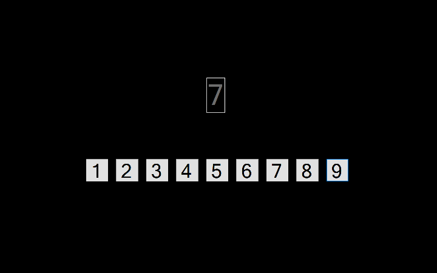

# two-back-cs
This is the c# version of an old cognitive science experiment that I coded a while back. Subjects were asked to click on a number corresponding to the number  that had been displayed two items previously in the sequence. The subject responds by clicking one of the numbers diplayed on the screen. All responses are stored in a text file.

